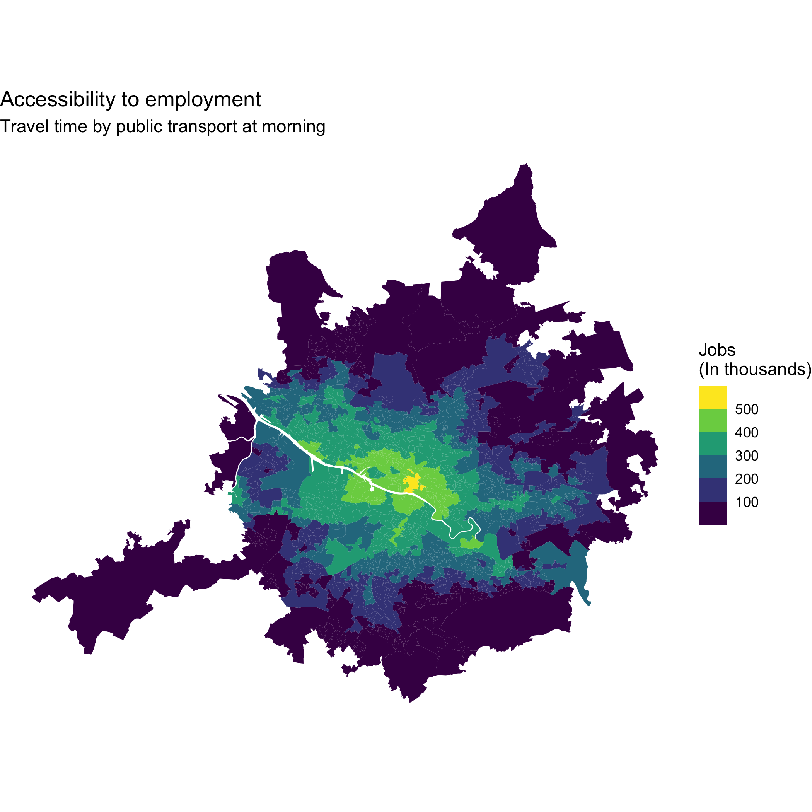

# Analysis pipelines with `targets`

## Why do I need targets?

Have you ever had to re-run an entire analysis from the beginning because you changed one input file or modified a single step in your code? or, have you came across a code-based project developed by someone else, and you don't know where to start?! This can become particularly frustrating when some parts of the analysis take a long time to run or when a project consists of many scripts that need to be executed in a particular order.

This is where `{targets}` comes in handy. It helps you organise an analysis as a pipeline of connected steps, where the output of one step becomes the input of another. targets keeps track of these relationships and knows which parts of the analysis need to be re-run when something changes. This makes complex analyses easier to manage, update, and reproduce, while avoiding unnecessary computation.

For those with `Python` experience, this very similar to `Snakemake`.

## How is this done? 

Think of targets as turning your analysis into a map of connected tasks. You define the main steps of your workflow—such as importing, cleaning, analysing, and visualising data—and specify how they depend on each other. targets then builds a dependency graph of these steps, so it knows what needs to be run and in what order.

You run the pipeline with `targets::tar_make()`. `{targets}` checks what has changed since the last run and re-runs only the steps affected by those changes, rather than running the whole analysis from scratch. This makes the your work more efficient and, importantly, makes the logic and dependencies of your analysis explicit and easier for others (or your future self) to understand and reproduce.

## Instructions

Overview: In this part, we will create a pipeline with some spatial functions which will in the end create a reproducible map showing accessibility by public transport to employment in Glasgow Region. To do so, we will follow the following conceptual steps. 

1. Download accessibility data (Pre-computed accessibility indices by public transport)
2. Download spatial data (Administrative boundaries in Scotland callde Data Zones)
3. Process and join data
4. Generate map

### Getting ready 

Continue working in your RStudio project where you left it. Alternatively, if you did have time to finish it, you can pick it up where we leave by downloading a copy of the repository from [here](https://github.com/rafavdz/reprod_workshop1) (click on the green botton that say 'Code' and then download). If you download it, then restore the environment following the instructions [here](#restore-environment).

Before moving forward, just check that the packages needed are there running:

``` r
renv::status()
```

`{renv}` should report that the project is consistent with the lockfile.

### A `{targets}` pipeline structure and an example

A `{targets}` pipeline is organised around a special `_targets.R` file, which acts as the blueprint for your analysis workflow. Inside this file, you define a series of targets (the individual steps of your analysis) and how they depend on one another. A typical pipeline might move from reading/downloading `data -> cleaning/processing data -> analysing/modelling data`, with each step becoming a target that `{targets}` can track and re-run when necessary.

To see what a basic `{targets}` project looks like, you can let the package create a small template for you including a toy pipeline example:

``` r
targets::use_targets()
```

This creates the basic files and folders needed to get started, including `_targets.R` file in your root directory.

### Exploring how `{targets}` works

Let's explore how `{targets}` represents the different steps and their dependencies. Start by opening the `_targets.R` which was created in the root directory and looking at the example that was just created.

You can visualise the pipeline with:

``` r
targets::tar_visnetwork()
```

::: {.callout-note}

When you run `targets::tar_visnetwork()`, you may be prompted to install the `visNetwork` package, which is used to display the pipeline as an interactive network.

If prompted, follow the instructions to install the package. Once it has been installed, remember to run `renv::snapshot()` so that the new dependency is recorded in your `renv.lock` file.

:::

This opens a diagram showing the targets in your pipeline and the relationships between them. Take a moment to explore the diagram and see how the different steps are connected.

Next, run the pipeline:

``` r
targets::tar_make()
```

`tar_make()` executes the targets in the order oulined in the list, based on their dependencies. A folder called _targets is created in the root directory. You can access these files and check for intermediate steps. You can learn more [here](https://books.ropensci.org/targets/data.html).

Once it has finished, run `targets::tar_visnetwork()` again and explore the differences. This helps to understand how `{targets}` keeps track of the workflow and its outputs.

Delete saved outputs of all or certain steps, run:

``` r
targets::tar_destroy()
```

To delete the saved results of steps that you might have deleted and will not use anymore, you could run:

``` r
targets::tar_prune()
```

### Setting _targets for our own analysis

You can simplify the `_targets.R` file by removing most of the explanatory comments muted with the hastag, particularly those describing the available target options. For this tutorial, we recommend keeping the configuration simple and setting the default storage format to qs:

``` r
tar_option_set(
  format = "qs"
)
```

The 'qs' format is a faster and more space-efficient alternative to the standard rds format. This is the format that targets will use to save the output of each target unless you explicitly use `format = "file"` or specify a different format within an individual tar_target().

It is also recommened removing the packages option from `tar_option_set()` and instead specifying the packages required by each `tar_target()` individually. This makes the pipeline more efficient and robust as each target only loads the packages it actually needs, reducing overhead and potential conflicts. For more configuration options, see the `tar_option_set()` documentation.

### Step 1 and 2 in our analyses

The recommended workflow is that you organise the your work with custom R functions. For instance, the first thing we need to do is download data. 

For this, create a in simple empty `R` script called `01_utils.R` and save it in the `R/` folder (create it if you don't have one). 

First we want to start by downloading the accessibility data using some code such as:

``` r
dir.create("./data/raw", recursive = TRUE, showWarnings = FALSE)
url_data <- 'https://huggingface.co/datasets/rafavdz/accessibility-indicators-2023/resolve/main/records/employment_all/access_employment_all_pt.csv'
file <- paste0("./data/raw/", basename(url_data))
  
download.file(
  url = url_data,
  destfile = file,
  mode = "wb"
)
```
We will wrap this steps in a function. So, in your `01_utils.R`, write the following:

``` r
# Download accessibility data
download_accessibility <- function() {
  dir.create("./data/raw", recursive = TRUE, showWarnings = FALSE)
  url_data <- 'https://huggingface.co/datasets/rafavdz/accessibility-indicators-2023/resolve/main/records/employment_all/access_employment_all_pt.csv'
  file <- paste0("./data/raw/", basename(url_data))
  
  download.file(
    url = url_data,
    destfile = file,
    mode = "wb"
  )
  
  return(file)
}
```

This data contains the accessibility levels for each cesus area in Great Britain (LSOA in England and Data Zone in Scotland).

Additionally, we will need the spatial data repsenting each of the Data Zones in Scotland. Then, write the following function in `01_utils.R`:

``` r
# Download data zone geometries in Scotland
download_datazone <- function() {
  dir.create("./data/raw", recursive = TRUE, showWarnings = FALSE)
  
  zip <- "./data/raw/SG_DataZoneBdry_2011.zip"
  dir <- "./data/raw/datazones_scotland"
  
  download.file(
    "https://huggingface.co/datasets/rafavdz/datazones_scotland2011/resolve/main/datazones_scotland.zip",
    zip,
    mode = "wb"
  )
  
  dir.create(dir, recursive = TRUE, showWarnings = FALSE)
  
  unzip(zip, exdir = dir)
  file.remove(zip)
  
  shp_path <- list.files(
    dir,
    pattern = "\\.shp$",
    recursive = TRUE,
    full.names = TRUE
  )
  
  return(shp_path)
}
```

#### Setting the new functions and targets to download data

Now, you have some download functions, which you can define by specifying the it in the `_targets.R` file as following:

``` r
tar_source(
  "R/01_utils.R"
)
```

This will run the R scripts in the `R/` folder with your custom functions.

Now, you can specify two targets in the list as following:

``` r
# target list
list(
  # 1. Download accessibility data
  tar_target(
    name = access_data,
    command = download_accessibility(),
    format = "file" 
  ),
  # 2. Download spatial data
  tar_target(
    name = datazone_scotland,
    command = download_datazone(),
    format = "file" 
  )
)
```

As you can see, each target follows a simple structure. The name gives the target a unique name, which is how you refer to its output in subsequent targets. The command specifies what should be run to create that target—in this case, a function. You can also include arguments within the function call when needed, and specify packages required by a particular target, although we do not need to do this yet. 

Notice that we have set `format = "file"` for both targets. This tells targets that these commands produce files, rather than R objects, and allows targets to track those files as part of the pipeline.

#### Running download targets

Now that the two download targets have been defined, let's check how they appear in the pipeline and then run them. First, use `targets::tar_visnetwork()` to explore the dependency graph and confirm that both targets are included. Then run the pipeline with:

``` r
targets::tar_make()
```

`{targets}` will execute the two download functions and save the resulting files in the locations specified by those functions. Once the pipeline has finished, explore the `data/` folder in your project. You can then run `targets::tar_visnetwork()` again to see that the targets have been completed and that their outputs are now being tracked by `{targets}`.

### Step 3 - Processing spatial data

Now you have a sense of the logic in targets. We will move on to the processing of the data that we just downloaded. To do so, create a create a in simple empty `R` script within the `R/` folder called `02_processing.R`.

In this R file we will write our processing flow (simple for the sake of example but with various spatial operations):

``` r
# Fun process accessibility and spatial data
process_access <- function(access_data, datazone_scotland) {
  
  # Read data
  accessibility_indices <- readr::read_csv(access_data)
  datazones <- sf::st_read(datazone_scotland) |> 
    st_transform(27700)
  
  # Glasgow city centre
  glasgow_cc <- sf::st_point(c(-4.256300, 55.860484)) |>
    sf::st_sfc(crs = 4326) |> 
    sf::st_transform(27700)
  
  # Subset
  datazones_glasgow <- datazones |> 
    sf::st_filter(st_buffer(glasgow_cc, 10e3)) 
  
  # Join accessibility data to Glasgow
  datazones_glasgow <- datazones_glasgow |> 
    left_join(accessibility_indices, by = c('DataZone' = 'geo_code')) 
  
  # Return SF Glasgow with access data
  return(datazones_glasgow)
}

```

### Step 4 - Modelling or creating ouputs

The step above subset and joins the data to the geometry. From here, we can continue modelling or excutening further analysis. For this example, we will create a static map. So, in the `02_processing.R`, include the following function, too:

``` r
# Create accessibility map
plot_employment_access <- function(accessibility_sf){
  # Output directory
  dir.create(
    "./data/generated",
    recursive = TRUE,
    showWarnings = FALSE
  )
  
  # Output filename
  output_file <- "./data/generated/accessibility_map.png"
  
  # Create map
  map_ggplot <- accessibility_sf |>
    dplyr::filter(time_of_day == "am") |>
    ggplot2::ggplot() +
    ggplot2::geom_sf(
      ggplot2::aes(fill = access_employment_all_45 / 1e3),
      linewidth = 0
    ) +
    ggplot2::labs(
      title = "Accessibility to employment",
      subtitle = "Travel time by public transport at morning",
      fill = "Jobs \n(In thousands)"
    ) +
    ggplot2::scale_fill_viridis_b(n.breaks = 6) +
    ggplot2::theme_void()
  
  # Save map
  ggplot2::ggsave(
    plot = map_ggplot,
    filename = output_file
  )
  
  # Return filename so targets can track the file
  output_file
  
}
```

Note that it is a good practice to keep util, processing (and potentially other types of tasks), in separate files. Also, it is a good idea to keep some sequential numbering.

### Excecuting the full pipeline

Following the logic above, what the next step?... 

That's right! We will specify where the next function lives, and create new targets in the list. For the first part adjust the code to let target know about the new functions:

``` r
tar_source(c(
  "R/01_utils.R", 
  "R/02_processing.R"
))
```

Then, expand the targets list with the Step 3 and 4 as following:

``` r
  # 3. Process and join data
  tar_target(
    name = subset_glasgow,
    command = process_access(
      access_data = access_data,
      datazone_scotland = datazone_scotland
    ),
    packages = c("dplyr", "readr", "sf"),
    format = "qs"
  ),
  # 4. Generate map
  tar_target(
    name = accessibility_map,
    command = plot_employment_access(
      accessibility_sf = subset_glasgow
    ),
    packages = c("dplyr", "ggplot2", "sf"),
    format = "file"
  )
```

The next two targets extend the pipeline by processing the downloaded data and then producing a final map. The 'subset_glasgow' target runs `process_access()` using the outputs of the two previous targets ('access_data' and 'datazone_scotland'), so `{targets}` knows that these data must be available before this step can run. 

It also specifies the `R` packages required for each of these particular steps. The resulting object is stored using the 'qs' format. The 'accessibility_map' target then takes `subset_glasgow` as its input and passes it to `plot_employment_access()` to create the map. Here, 'format = "file"' tells `{targets}` that the output is a file rather than an R object, allowing it to track the generated map as part of the pipeline.

### Build the full pipeline

Before runnig the extented pipeline, visualised it using `targets::tar_visnetwork()`. This should map where you are at the moment with the analysis, e.g. downloaded the data, there are new functions, new outcomes, but some of these are outdated.

Now, run the targets with `targets::tar_make()`. This should only excecutre the outdated targets. Crucially, it should generate our accessibility map as following:



If for some reason, something didn't go well or there was not enough time to complete this activity, you can download the complete activities from [this repo](https://github.com/rafavdz/reprod_workshop2). You should be able to quickly restore the renv, and the, simply run `target::tar_make()`.

## Limitations and next steps

Taken together, `renv` keeps track of the exact packages we need, while `targets` makes the steps of our analysis clear. But there is still a bit more going on behind the scenes. Our results can also depend on the version of R we are using, the operating system, system libraries, etc. `Docker` allows us to capture this wider computing environment in a reproducible container. In the next chapter, we will see how Docker and Binder can bring these pieces together and make the whole workflow easier for others to reproduce.