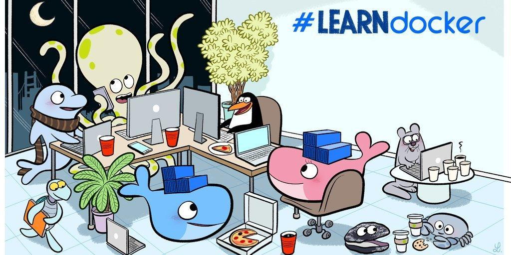
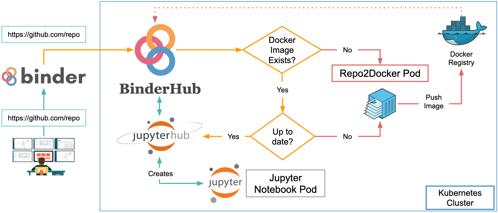

# Containers: Your own `Git` repository reproducible in `Binder`

[^1]

[^1]: Source: [DockerLabs](https://github.com/collabnix/dockerlabs).


Imagine that, instead of sending someone your analysis and asking them to install `R`, the right packages, system libraries, and other software, you could simply put the whole computer you used for the analysis in a box and post it to them. They could open the box, switch it on, and run the analysis in exactly the same environment. Of course, we can't do this, but this is roughly the idea behind containers. A container packages a software and system components it needs to run, providing a consistent environment across different computers.

`Docker` is a widely used technologies for creating and running these containers. Instead of packaging an entire physical computer, `Docker` allows us to define a lightweight, reproducible computing environment containing things such as a particular version of `R`, R packages, system libraries, and other software required by the project. We can describe this environment in a `Dockerfile`, build it into a Docker image, and then run that image as a container. In this way, Docker extends what we have done with renv. Specifically, we can capture much more of the environment in which those packages and the analysis run as done previously.

## Docker and Binder

In this workshop, we will use `Docker` together via [Binder](https://mybinder.org/) as one way of making a project easier for others to reproduce. `Docker` defines the computing environment, while `Binder` can take the project and its container configuration and make it available through a simple web browser! So, anyone can launch the project without first installing R, configuring the required packages, or setting up Docker on their own computer. Magic!

However, `Binder` is not a solution for every project. Resources such as computing power and session time are limited, and Binder is generally better suited to interactive or educational projects. Still, full analysis examples are available out there accompanying published papers (be patient as it takes a while to launch): 

* GitHub: <https://github.com/Gchism94/NestArchOrg> and respective [Binder](https://mybinder.org/v2/gh/parkgayoung/racisminarchy/master?urlpath=rstudio)
* https://github.com/bbartholdy/mb11CalculusPilot
* https://github.com/parkgayoung/racisminarchy

For this workshop, we will use Binder to run our Docker-based environment through a web browser, so participants do not need to install Docker or configure the environment locally. Running Docker directly on a computer is a more flexible option, particularly when you need more control or computing resources, but that workflow is beyond the scope of this tutorial.



<!-- ## Why do I need to learn about Docker? -->

<!-- You might reasonably ask: if renv and targets already make my R project reproducible, why do I need Docker? This is because reproducibility has several layers. `renv` helps us reproduce the `R` package environment, and targets helps us reproduce the analysis workflow, but neither necessarily captures everything installed on the computer. An analysis might also depend on a particular version of R, system libraries,etc. -->

<!-- Fro now, the important thing is to understand the basic idea: instead of asking someone to recreate your computing environment manually, you give them a description of that environment that can be used to recreate it automatically. Combined with `renv` and `targets`, this gives us a much more complete reproducible workflow. -->

## Task

This walks through the final `Dockerfile` used to launch the Binder container to reproduce our examples available [here](https://mybinder.org/v2/gh/YOUR-USERNAME/YOUR-REPOSITORY/main?urlpath=rstudio).

## Instructions

You will continue working on your Rstudio project. If there was not enough time to complete the activities of the previous step, you can download [this completed R Project from GitHub](https://github.com/rafavdz/reprod_workshop2), and pick it up from there.

Create a simple empty text file name `Docker` in your root directory.

### Choose the base image

Start from the Rocker Project's `binder` image, pinned to the exact R version recorded in `renv.lock`. Please check which version you are using.

```dockerfile
FROM rocker/binder:4.4.1
```
In this case, we are not trying to recover an older workflow in R. So, no need to go back in time.

`renv.lock` records the R version the packages were snapshotted against, so the container's R version and the lockfile's R version need to match for `renv::restore()`.

## Install system libraries for spatial operations

The project uses `sf`/`terra`, which link against GDAL, GEOS, and PROJ at the C/C++ level. `rocker/binder` doesn't include these by default (that's only the `rocker/geospatial` family), so they're installed manually. This has to happen as `root`, then the shell drops back to the regular container user for everything else.

```dockerfile
USER root
RUN apt-get update && apt-get install -y --no-install-recommends \
    libgdal-dev \
    gdal-bin \
    libgeos-dev \
    libproj-dev \
    libudunits2-dev \
    && rm -rf /var/lib/apt/lists/*
USER ${NB_USER}
```

Without this step, `renv::restore()` either fails outright trying to compile `sf`/`terra` from source, or fails to find the headers it needs even if a source build is attempted.

`rm -rf /var/lib/apt/lists/*` at the end isn't strictly required, but it keeps the image smaller by discarding the package index Debian/Ubuntu downloaded for `apt-get update`.

## Set the working directory

```dockerfile
WORKDIR ${HOME}
```

`${NB_USER}` and `${HOME}` are environment variables already defined by the `rocker/binder` base image (`NB_USER=rstudio`, `HOME=/home/rstudio`). Using the variables instead of hardcoding `/home/rstudio` keeps the Dockerfile portable if the base image's user ever changes.

## Copy over the renv files first (not everything yet)

This next part is worth explaining. Instead of copying your whole repo in one go, we copy *just* the files `renv` needs to get going:

```
COPY --chown=${NB_USER} renv.lock renv.lock
COPY --chown=${NB_USER} .Rprofile .Rprofile
RUN mkdir -p renv
COPY --chown=${NB_USER} renv/activate.R renv/activate.R
COPY --chown=${NB_USER} renv/settings.json renv/settings.json
```

Why bother? `Docker` remembers each step and skips ones that haven't changed (it "caches" them). If we copied the entire repo and *then* restored packages, editing a single `R` script later would force `Docker` to reinstall every package again from scratch, even if nothing about the packages actually changed. By copying only the `renv` files first, the slow package-install step only reruns when `renv.lock` is changed.

`--chown=${NB_USER}` ensures these files are owned by the container's regular user, not `root`. Otherwise, later R sessions running as `rstudio` could hit permission errors touching renv's files.

## Restore the packages

```dockerfile
RUN R -e "renv::restore()"
```

This is the actual install step, namely: it reads `renv.lock` and installs every package it lists. A couple of things worth knowing about this choice:

- We're keeping `renv` **active**, meaning it stays turned on inside the container. So when someone opens RStudio later, renv quietly worka in the background and the environment is already exactly as pinned (no reinstalling, just picking up what's already there).
- We're *not* deleting `renv.lock` or `.Rprofile` afterward. We're keeping them because this is a reproducibility workshop. So, people should be able to actually open the lockfile and see what's there.

## Copy the rest of the repository

```dockerfile
COPY --chown=${NB_USER} . ${HOME}
```

With packages already installed, we bring in everything else — the scripts, `_targets.R`, data folders, all of it. Because this happens *after* the cached restore layer, changing any of these files and rebuilding only re-runs this `COPY` and nothing above it.

## Declare how the container runs

```dockerfile
EXPOSE 8888
CMD ["jupyter", "lab", "--ip", "0.0.0.0", "--no-browser"]
```
These last two lines are just carried over from the original `rocker/binder` image. Binder expects something listening on port 8888, and that's what starts it up. RStudio isn't launched by this line directly; it's reached through a proxy the base image already has built in (more on that below).

## Final Dockerfile

So your final Docker file should look as following:

```dockerfile
FROM rocker/binder:4.4.1

# --- system libraries for sf/terra ---
USER root
RUN apt-get update && apt-get install -y --no-install-recommends \
    libgdal-dev \
    gdal-bin \
    libgeos-dev \
    libproj-dev \
    libudunits2-dev \
    && rm -rf /var/lib/apt/lists/*
USER ${NB_USER}

WORKDIR ${HOME}

# --- copy only the renv bootstrap files first (better build-cache reuse) ---
COPY --chown=${NB_USER} renv.lock renv.lock
COPY --chown=${NB_USER} .Rprofile .Rprofile
RUN mkdir -p renv
COPY --chown=${NB_USER} renv/activate.R renv/activate.R
COPY --chown=${NB_USER} renv/settings.json renv/settings.json

# --- restore into renv's own project library (kept active at runtime) ---
RUN R -e "renv::restore()"

# --- now copy the rest of the repository ---
COPY --chown=${NB_USER} . ${HOME}

EXPOSE 8888
CMD ["jupyter", "lab", "--ip", "0.0.0.0", "--no-browser"]
```

Save this in your project, and commit changes and push to GitHub.

## Launching the Git project to Binder (Optional)

With the Docker file ready, now we can move to the following easy steps. 

Simply go to <https://mybinder.org/>. Paste the GitHub URL and click the 'Launch' button. 

In the background, `Binder` takes care of the infrastructure. In short, it starts a temporary cloud server, gets the files from your repository, and uses your `Docker` configuration to build (or retrieve) a `Docker` image containing the required software and dependencies. It then starts a container from that image and connects it to a web interface. From your perspective, all of this happens automatically: you simply wait for Binder to finish building the environment and then access your project through your browser.

The first time you launch Binder, it may take longer because it needs to build the Docker image and install the required dependencies. Subsequent launches are usually faster because the existing image can be reused, although this depends on the size of the environment and whether the repository has changed.

### Add the Launch-in-Binder badge (Optional)

Add the following in your README.md in your RProject.

```
[](https://mybinder.org/v2/gh/rafavdz/reprod_workshop3/main?urlpath=rstudio)
```

This gives anyone visiting the repository a one-click route into a running RStudio session with the environment already restored.

## Alternatevly just launch the example Binder

You can access the intended Binder direly clicking on the button below. 

[](https://mybinder.org/v2/gh/rafavdz/reprod_workshop3/main?urlpath=rstudio)

This will prompt an RStudio environment ready with the packages you set ein renv. Next, just simply proceed to run `targets::tar_make()` to reproduce all the steps, starting with the download of data, etc. You can check the final output (accessibility map), at the path `data/generated/accessibility_map.png`.

